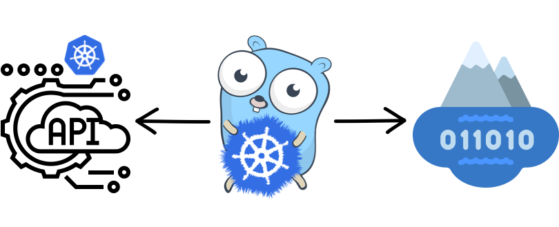
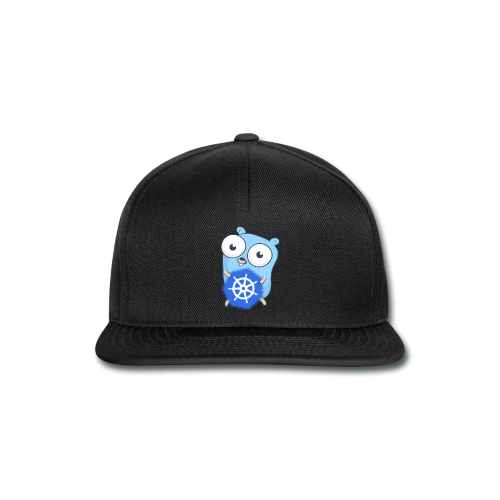
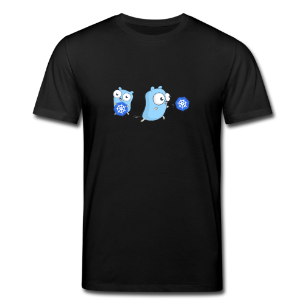

[](https://github.com/suecodelabs/cnfuzz/actions/workflows/go.yml) [](https://github.com/suecodelabs/cnfuzz/actions/workflows/docker-publish.yml) [](https://github.com/suecodelabs/cnfuzz/actions/workflows/kind.yml)


## cnfuzz - Cloud Native Web API Fuzzer

_"Breaking Cloud Native Web APIs in their natural habitat."_

Fuzzing web APIs in their fully converged Cloud Native state renders more representative results, just like it would have been deployed in production.

`cnfuzz` is a project written in Golang that automates fuzzing web APIs deployed in Kubernetes clusters. By tracking hashes of all container images, _(re)deployed_ web API versions will be fuzzed - to detect potential security and stability issues and stores its results in a [data lake](https://aws.amazon.com/big-data/datalakes-and-analytics/what-is-a-data-lake/).

[OpenAPI](https://www.openapis.org/) and [RESTler](https://github.com/microsoft/restler-fuzzer) by Microsoft are being used to further automate the process.

## Why?

- [x] You want to fuzz web API logic where they actually operate, especially when fuzzing complete **Service Meshes**
- [x] You want to integrate and/or build **data lakes** with fuzzing data on top of **AWS S3** based storage
- [x] You want to save expensive Cloud CI/CD pipeline credits by using *idle* Kubernetes cluster resources
- [x] You want fuzzing te be done outside of your CI/CD pipeline
- [x] You have heavy performance requirements for your fuzzing and Cloud based CI/CD pipelines do not suffice
- [x] You want to fuzz web API's of services which are interconnected and are being deployed by different teams in the same Kubernetes cluster
- [x] You want to automatically fuzz existing opensource software for instability issues
- [x] You get excited over fuzzing farms

## Architecture



## Usage
### Installation

```sh
helm repo add cnfuzz https://suecodelabs.github.io/cnfuzz
helm repo update
helm install cnfuzz cnfuzz/cnfuzz
```

### Getting started

All it takes to getting started after installation of `cnfuzz` on your Kubernetes cluster is to `annotate` your Kubernetes `Pods`, `Deployments`, `DaemonSets`, etc like in the following example:

```yaml
apiVersion: apps/v1
kind: Deployment
metadata:
  name: my-api
spec:
  selector:
    matchLabels:
      app: my-api
  replicas: 1
  template:
    metadata:
      labels:
        app: my-api
      annotations:
        cnfuzz/enable: "true"
        cnfuzz/open-api-doc: "/swagger/swagger.json"
        cnfuzz/secret: "0d5989ed-d60c-470e-b1b5-576fcf0f5d8c"
    spec:
      containers:
        - name: myapi
          image: my-api
          imagePullPolicy: Always
          ports:
            - containerPort: 80
```


### Setup Kubernetes development environment

- Install [Kind](https://kind.sigs.k8s.io/) and/or [Rancher Desktop](https://rancherdesktop.io/)

- Install [Helm](https://helm.sh/docs/intro/install/)

### Build and run
#### Kind

```sh
# don't forget to commit your changes locally before deploying to Kind.
make kind-init
```
#### Rancher Desktop

```sh
# don't forget to commit your changes locally before deploying to Rancher Desktop.
make rancher-init
```

These commands do the following:
- Setup initial deployment of `cnfuzz`
- Build a container image and load it into `Kubernetes`
- Install `cnfuzz` via helm with the local built image
- Create example webapi deployment to fuzz

#### Kind

```sh
# don't forget to commit your changes locally before deploying to Kind.
make kind-build
```
#### Rancher Desktop

```sh
# don't forget to commit your changes locally before deploying to Kind.
make rancher-build
```

These commands do the following:
- (re)-build `cnfuzz` and upgrade deployment with latest image

#### Cleanup the build

This command does the following:
- delete the `cnfuzz` installation from `Kubernetes`

```sh
make k8s-clean
# If you did a git pull between the above build and the below k8s-clean
# you will see an error. Specify the release as follows:
make k8s-clean GIT_COMMIT=f4fd3d2
```

### Build project

For building the project you can use the [`Makefile`](./Makefile).

#### Build Docker image

```sh
IMAGE=myrepo/cnfuzz make image
```
#### Compile binary

```sh
# Compile project to binary dist/cnfuzz
make build
```

### Prepare for release

```sh
cd docs
helm package ../charts/cnfuzz
helm repo index --url https://suecodelabs.github.io/cnfuzz/ .
```

## Roadmap

- [x] Opensource graduation research project ❤️
- [ ] Support [Kustomize](https://kubernetes.io/docs/tasks/manage-kubernetes-objects/kustomization/)
- [ ] Integrate more tightly with Kubernetes
- [ ] Autodiscovery of possible URI prefixes

## Sponsors

- [Sue B.V. - Cloud Native Solutions](https://sue.nl/)

## Engineering Team

- Luuk van den Maagdenberg, Lead Developer
- Pim Merks, Developer
- Robert Scholts, Developer
- Sylvia van Os, Developer
- Ofer Chen, Developer
- Serge van Namen, Developer / Community Lead
- Hans Strijker, Maintainer
- Sam Crauwels, Maintainer
- Michiel Westerink, Maintainer

## Community

Every first Thursday of the month at 18:30 CET there will be a hybrid community meetup for users, developers and maintainers of the project hosted at Sue B.V. in the Netherlands.

[Google Meet](https://meet.google.com/zom-asij-qkq) or see you at [Sue B.V.](https://g.page/SueBV?share) including lovely drinks and food before the meetup!

## Swag

Do you want swag that our awesome marketing team created for this project?
Come to our community meetup on prem or contact marketing@sue.nl to receive your swag!

### Stickers & Gear

<div align="center">

</div>

<div align="center">

</div>

## Support

Do you need support that cannot be handled via issue tracking? Please contact us at <engineering@sue.nl> or via the contact form on [this](https://sue.nl/cnfuzz/) page.
