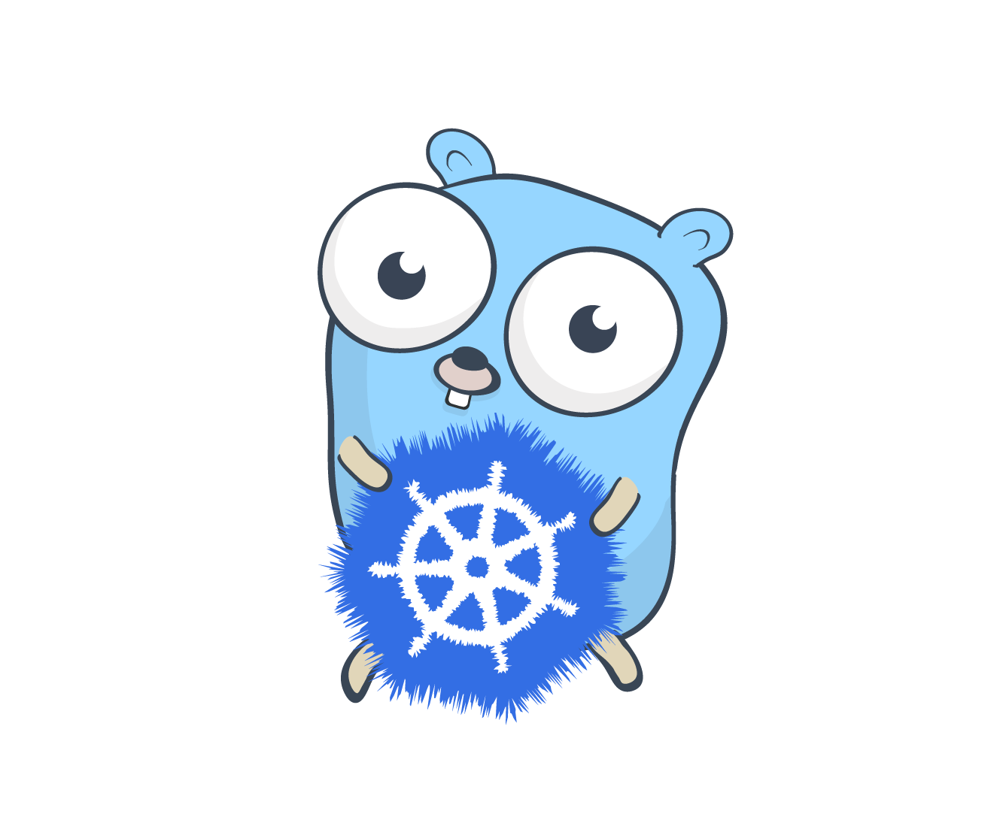

## cnfuzz - Cloud Native Web API Fuzzer

_"Breaking Cloud Native Web APIs in their natural habitat."_

Fuzzing web APIs in their fully converged Cloud Native state renders more representative results, just like it would have been deployed in production.

`cnfuzz` is a project written in Golang that automates fuzzing web APIs deployed in Kubernetes clusters. By tracking hashes of all container images, _(re)deployed_ web API versions will be fuzzed - to detect potential security and stability issues.

[OpenAPI](https://www.openapis.org/) and [RESTler](https://github.com/microsoft/restler-fuzzer) by Microsoft are being used to further automate the process.

### Installation

`helm install cnfuzz ./charts/cnfuzz`

### Getting started

All it takes to getting started after installation of `cnfuzz` on your Kubernetes cluster is to `annotate` your Kubernetes `Pods`, `Deployments`, `DaemonSets`, etc like in the following example:

```yaml
apiVersion: apps/v1
kind: Deployment
metadata:
  name: my-api
spec:
  selector:
    matchLabels:
      app: my-api
  replicas: 1
  template:
    metadata:
      labels:
        app: my-api
      annotations:
        cnfuzz/enable: "true"
        cnfuzz/open-api-doc: "/swagger/swagger.json"
        cnfuzz/secret: "0d5989ed-d60c-470e-b1b5-576fcf0f5d8c"
    spec:
      containers:
        - name: myapi
          image: my-api
          imagePullPolicy: Always
          ports:
            - containerPort: 80
```


### Setup Kubernetes development environment

- Install [Kind](https://kind.sigs.k8s.io/).

- Install [Helm](https://helm.sh/docs/intro/install/)

```sh
# don't forget to commit your changes locally before deploying to Kind.
make kind
```


### Build project

For building the project you can use the [`Makefile`](./Makefile).

#### Build Docker image

```sh
IMAGE=myrepo/cnfuzz make image
```
#### Compile binary

```sh
# Compile project to binary dist/cnfuzz
make build
```

## Roadmap

- [x] Opensource graduation research project ❤️
- [ ] Support [Kustomize](https://kubernetes.io/docs/tasks/manage-kubernetes-objects/kustomization/)
- [ ] Integrate more tightly with Kubernetes
- [ ] Autodiscovery of possible URI prefixes

## Sponsors

- [Sue B.V. - Cloud Native Solutions](https://sue.nl/)

## Engineering Team

- Luuk van den Maagdenberg, Lead Developer
- Pim Merks, Developer
- Hans Strijker, Developer
- Robert Scholts, Developer
- Serge van Namen, Developer / Community Lead

## Community

Every first Thursday of the month at 18:30 CET there will be a hybrid community meetup for users, developers and maintainers of the project hosted at Sue B.V. in the Netherlands.

[Google Meet](https://meet.google.com/zom-asij-qkq) or see you at [Sue B.V.](https://g.page/SueBV?share) including lovely drinks and food before the meetup!

## Support

Do you need support that cannot be handled via issue tracking? Please contact us at <engineering@sue.nl>

<div align="center">

</div>
